#### HTML标签学习
###### 基础标签
+ html骨架获取（vscode）：!(英文)+回车
+ 标题用h1双标签（一共可以用六级标题）
+ 一段话用p双标签
+ 水平分割线用hr标签
+ 一些常见标签
   + br 换行
   + b strong 加粗
   + u ins 下划线
   + i em 倾斜
   + s del 删除线
+ 图片
  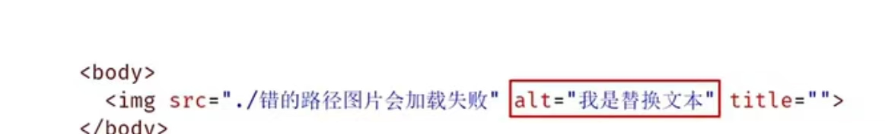
   + title="这里写鼠标悬停的信息" weight="" high="" 长宽只写一个就是默认比例，写两个写不好就可能丑）
+ 绝对路径
   + 复制的那个路径
+ 相对路径
   + 当前目录：文件名或./文件名
   + 下级目录：文件夹名/文件名
   + 上级目录：../
+ 音频标签：
   + audio双标签
  
   + 音频标签目前支持三种格式：MP3,Wav,Ogg
+ 视频标签：
   + video双标签
   + 常见属性和音频标签差不多一致
     + autoplay自动播放在谷歌浏览器中需配合muted实现静音播放
   + 音频标签目前支持三种格式：MP4,Wav,Ogg
```html
  <video src=""></video>
  ```
+ 链接标签：
  + a双标签
 
 
+ 以下不是标签，是一些用语
   + index.html 网页首页
   + 跳转网页名称可以用one.html two.html，以此类推
  
###### 列表标签
+ 列表的种类：
   + 无序列表
   + 有序列表
   + 自定义列表
+ 无序列表
   + ul双标签
   + 想在里面列点就在ul里面加上li双标签（一个点一对标签）
   + Note：ul里面只能包含li，li里面可以包含任何内容
+ 有序列表
   + 跟无序差不多，唯一区别就是把ul换成ol
+ 自定义列表
   + dl双标签表示整体
   + dt表示自定义列表主题
   + dd表示自定义列表针对主题的每一项内容
   + Note：dl里面只允许dt/dd，dt/dd里面可以包含任意内容

###### 表格标签
+ 基本标签：
   + table双标签表示表格整体（用于包裹tr）
   + tr双标签表示表格每行（用于包裹td）
   + td双标签表示单元格（用于包裹内容）
   + Note：嵌套关系：table > tr > td
+ 表格相关属性：（在table标签里面设置）
   + border 效果：边框宽度
   + width 效果：表格宽度
   + height 效果：表格高度
   + 实例效果：
    
+ 表格标题和表头单元格标签
 
   
   
+ 表格的结构标签（了解即可）：
   + thead 表格头部
   + tbody 表格主体
   + tfoot 表格底部
   + Note：表格结构标签内部用于包裹tr标签，这玩意可以省略（hhh）
+ 合并单元格
   + 将水平或垂直多个单元格合并成一个单元格
   + 左上原则：
     + 上下合并->只保留最上的，删除其他
     + 左右合并->只保留最左的，删除其他 
   + 标签（在td标签里面加属性哦，eg：rowspan="合并的数量"）：
     + rowspan：垂直合并（跨行合并）
     + colspan：水平合并（跨列合并）
   + Note：只有同一个结构标签才能合并（即不能跨：thead，tbody，tfoot）

###### 表单标签
+ 应用场景：让用户输入的，例如登录/注册/搜索（很局限，可以慢慢记）
+ input系列标签：
     + 基本使用：
     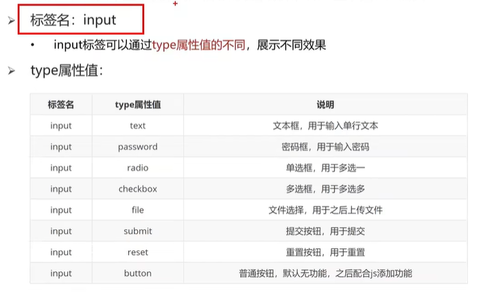
    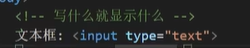
    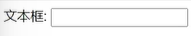
   + 占位符（输入框里的提示信息）：
       + 属性名：placeholder
   + 单选框：
   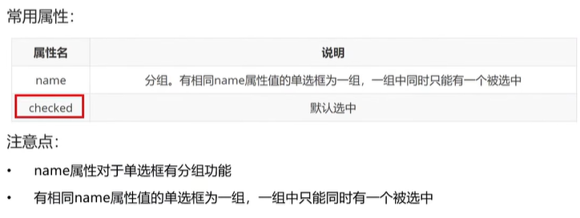
   + 文件选择：
       + type属性file，默认是选择单文件
       + 多文件选择，需添加属性multiple
   + 按钮：
       + 注意是type属性哦~
      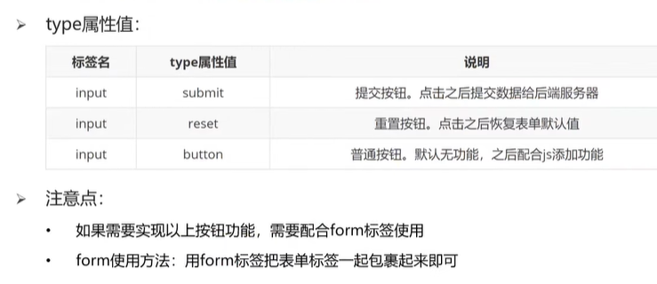
      + 想改按钮文字可以加属性value="这里填文字内容"
      + Note：提交按钮，重置按钮需要把可以提交，重置的内容放到一个表单域form里。如下图
      + 这里的action后面接的是提交地址
         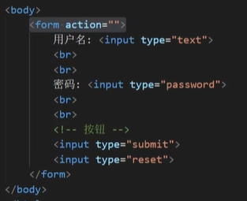
+ botton双标签：
  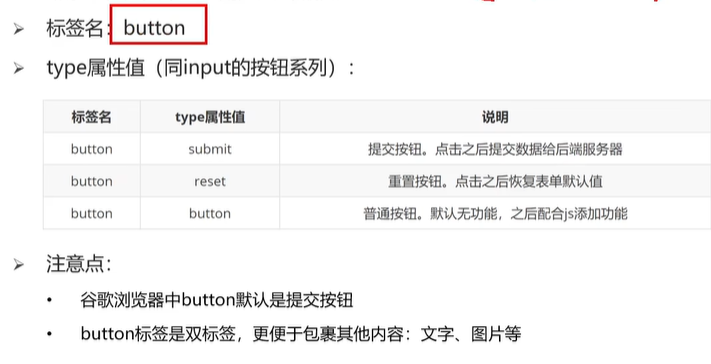
      + 实例：
      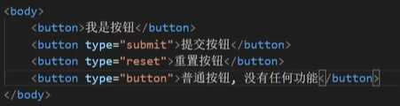
      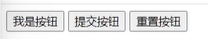
+ select标签
  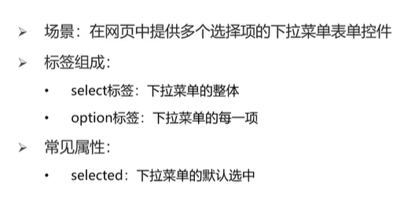
+ textarea双标签
  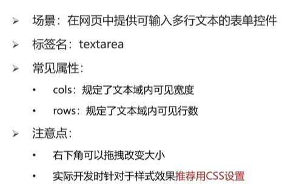
  + 拖拽功能后面css要禁用（hhh）
+ lable标签
  + 可以用于例如做单选的时候，点每个选项对应的照片也能选上
  + （记第二个就得了，第一个麻烦死）
  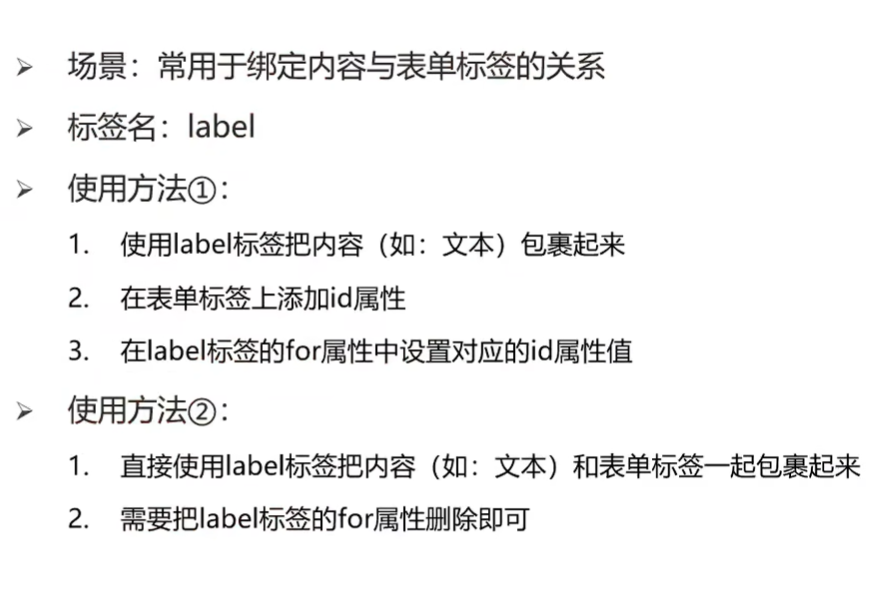
  试例：
  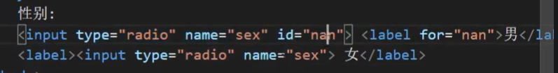

还有两个就完结了耶！（下次记得删）
###### 语义化标签
###### 字符实体