## 深度强化学习
###### 该笔记内容来自bilibili【王海森】深度强化学习课程

#### 一.基本概念
+ Random Variable（随机变量）X为随机变量，x为观测值
+ Probability Density Function（概率密度函数）：随机变量在某个确定的取值点附近的可能性
+ Expectation（期望）：
   
+ Random Sampling（随机抽样）
+ state（状态）
+ Action（动作）
+ Agent（智能体）：动作的主体
+ policy ：根据agent的状态做出决策控制运动
+ reward：agent做出一个动作就给予奖励
+ state transitions（状态转移）
+ agent和environment的关系

+ 随机性的来源
   + actions的随机性：根据policy函数随机抽样得到
   + state transitions的随机性：环境跟状态转移函数p随机抽样

+ Return：未来的累计奖励
 + Discounted Return：折扣回报（未来的会有一定权重）
  

 + Action-value function（动作价值函数）
 

 + Optimal action-value function（最优动作价值函数）

 + State-value function（状态价值函数）
  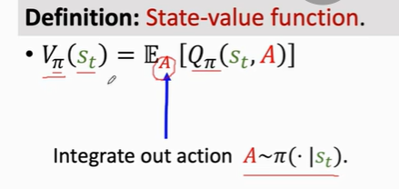
  （这里将a积掉，只剩下派和s，已知两个中的一个可以用函数判断另一个的大小）
   + 当a是离散变量，我们有
  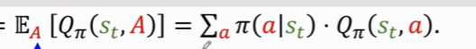 
  若a连续，可以用积分代替连加
### 二.价值学习，Value-Based Reinforcement Learning
###### Deep Q-Network（DQN）：用神经网络来记住Q值
+ 使用TD算法来学习：TD（时序差分）算法用“当下立即奖励 + 下一刻估计值”来更新此刻估计值
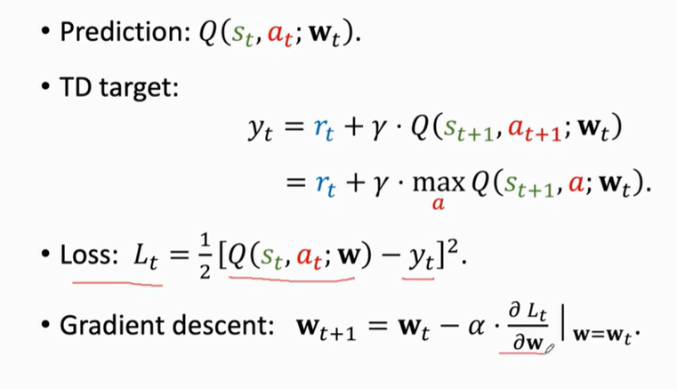
### 三.策略学习，Policy-Based Reinforcement Learning
+ policy function
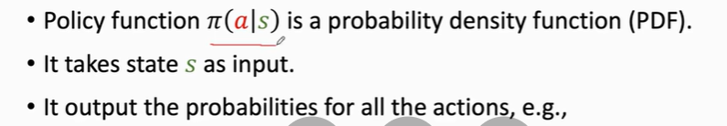
+ policy network（策略网络：用神经网络近似策略函数）
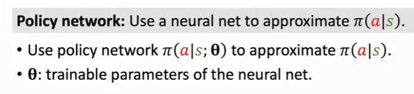
+ approximate state-value function（基于神经网络的近似状态价值函数）：
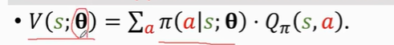
  + 为了让该状态价值更大，容易知道要提升cita
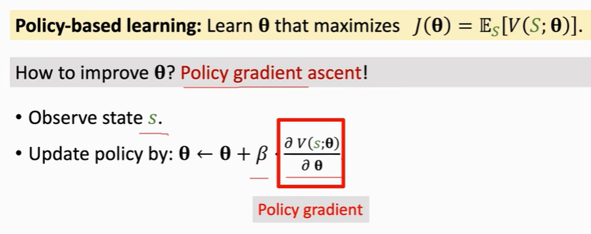
+ policy gradient（策略梯度）
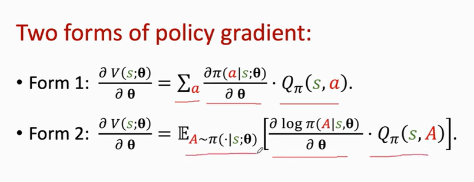
（推导过程这里不详细列出）
  + 同样的，离散的动作状态用form1（但不适用于连续动作）
  + 连续的动作用form2，这里求期望无法积分，要用蒙特卡洛近似（用一个样本近似期望）
  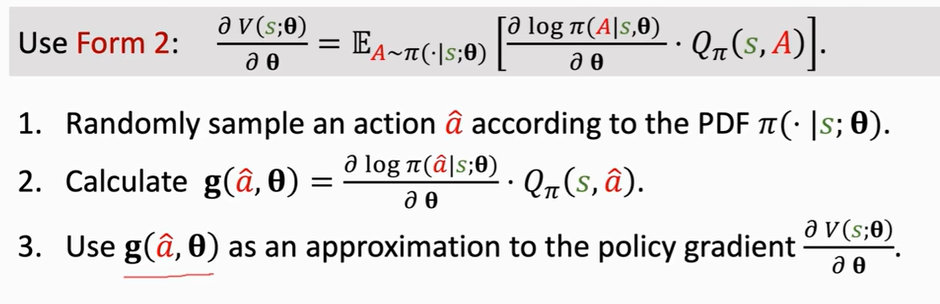
  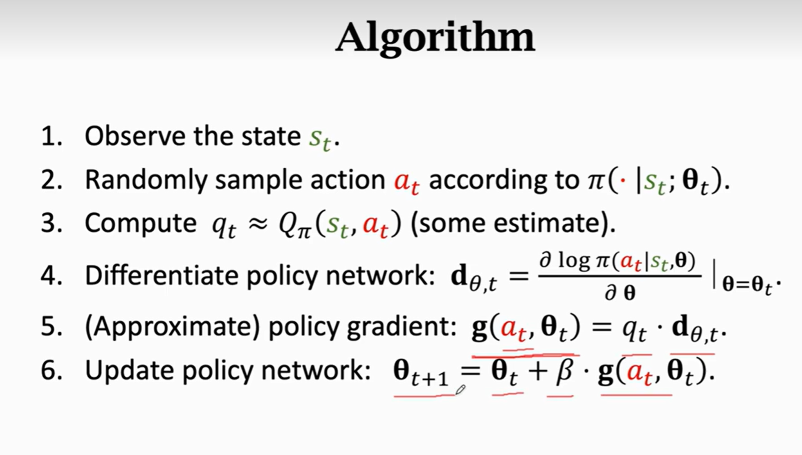
  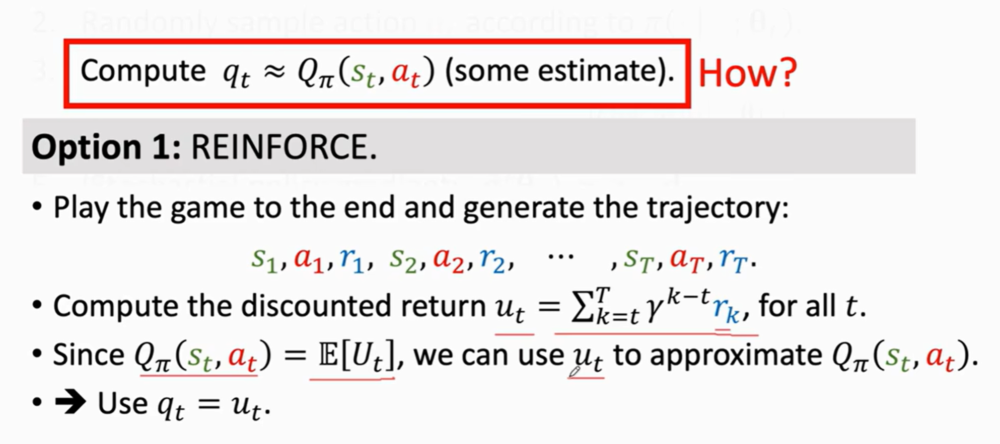
  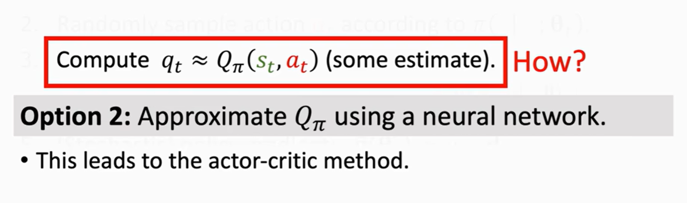
  （这里听得云里雾里）

### 四.价值和策略学习结合，Actor-Critic Methods
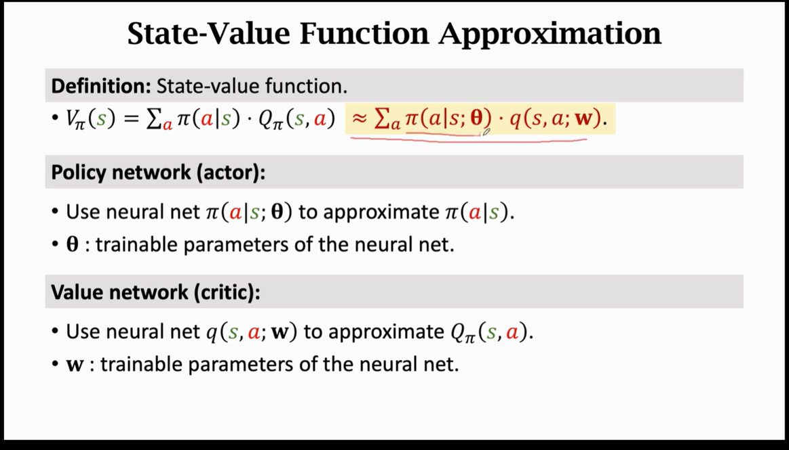
+ 相当于：actor是运动员，critic是裁判打分
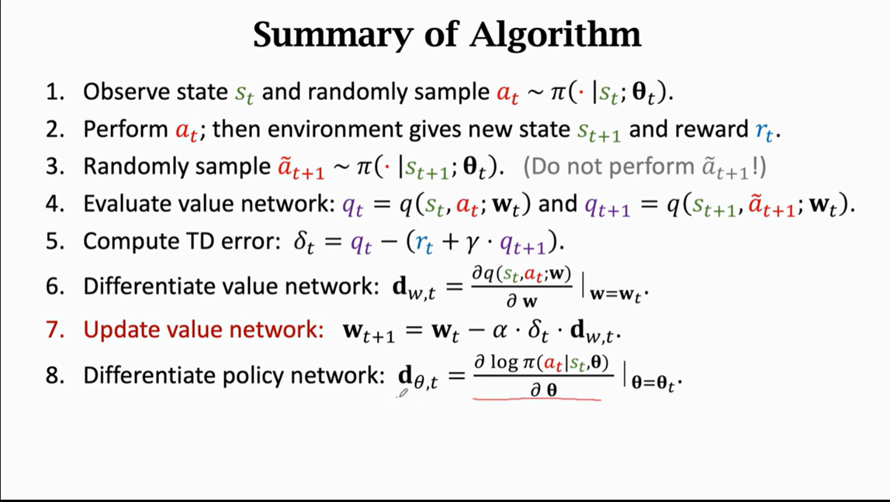

